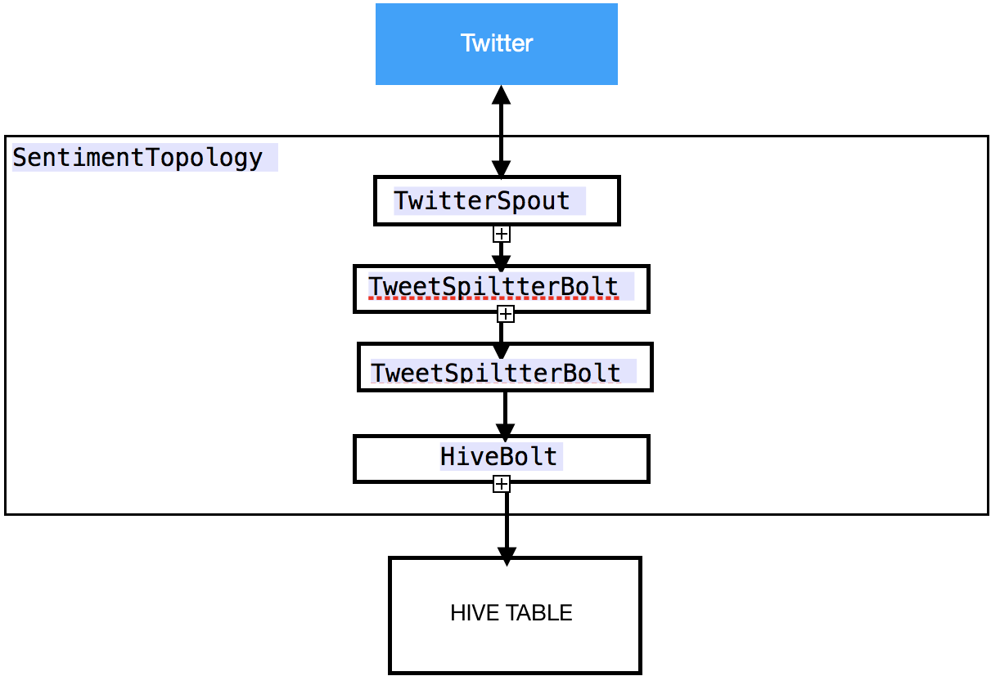
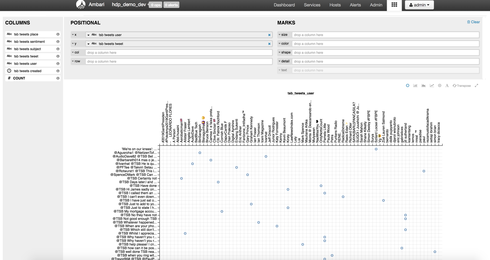

# hdp-demo-storm-twitter

Storm topology to stream in tweets, perform basic sentiment analytics and store results in Hive table (using HiveBolt).

## Presentation

The Storm topology 

## Deployment

Checkout the code and build it with maven using :

    clean package

To run the topology :

    storm jar hdp-demo-storm-twitter-0.0.1-SNAPSHOT.jar hdp.demo.storm.topology.SentimentTopology <local|cluster> <twitter consumer key> <twitter consumer key secret> <twitter access token key> <twitter access token secret>

Create the tweet_counts Hive table corresponding to your needs :

    CREATE TABLE tsb_tweets(subject STRING, user STRING, place STRING, created STRING, tweet STRING, sentiment STRING, weight int)
    CLUSTERED BY (sentiment) INTO 3 BUCKETS
    STORED AS ORC
    TBLPROPERTIES('transactional'='true');

## Example

What we can view in the Hive view in Ambari (Hortonworks distribution) :

